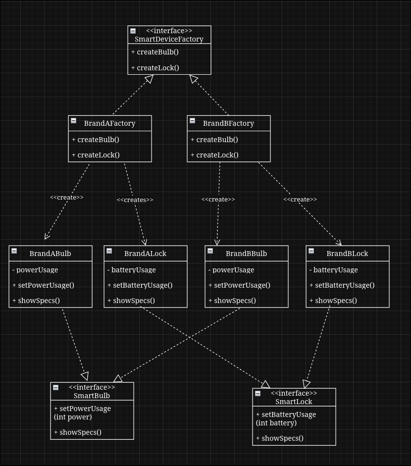

Smart Home Simulator
====================

A simple Java project that simulates smart home devices (smart bulbs and smart locks) using the Abstract Factory Method design pattern.
Device usage data is read from text files and displayed in the console.

Features
--------
- Create smart bulbs and locks from different brands
- Read power/battery usage from external files (bulb.txt, lock.txt)
- Display device specifications in the console
- Demonstrates the Abstract Factory Pattern in Java

Project Structure
-----------------
Architecture_assignment1/
- src/  
  - BrandABulb.java — Brand A implementation of Smarbulb
  - BrandALock.java — Brand A implementation of SmartLock 
  - BrandAFactory.java — Factory that creates Brand A devices  
  - BrandBBulb.java — Brand B implementation of SmartBulb  
  - BrandBLock.java — Brand B implementation of SmartLock  
  - BrandBFactory.java — Factory that creates Brand B devices  
  - SmartBulb.java — SmartBulb interface (setPowerUsage, showSpecs)  
  - SmartLock.java — SmartLock interface (setBatteryUsage, showSpecs)  
  - SmartDeviceFactory.java — SmartDeviceFactory interface (createBulb, createLock)  
  - Main.java — 
  - TestDriver.java — Test driver that demonstrates:  
    - Creating a Bulb from Brand A and setting power usage from bulb.txt  
    - Creating a Lock from Brand B and setting battery usage from lock.txt  
- bulb.txt 
- lock.txt

## Project Screenshots

- `screenshots/` – Contains output screenshots of the program.  
- `UML_diagram/` – Contains the UML diagram image of the project.

Example Input
-------------
bulb.txt
69

lock.txt
69

Output Screenshots
------------------

UML Diagram
------------------

How to Run
----------
1. Clone the repo:
   git clone https://github.com/harshpatel5/Architecture_assignment1.git
   
   cd Architecture_assignment1

3. Compile the Java files:
   javac src/*.java

4. Run the program:
   java -cp src TestDriver

Concepts Covered
----------------
- Java OOP
- File handling (Scanner, File)
- Abstract Factory Design Pattern
